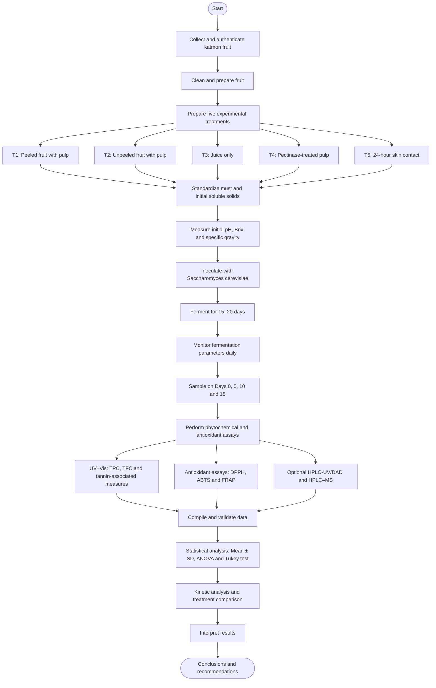

# Katmon Wine Fermentation Research

## Research Methodology Flowchart

```mermaid
flowchart TD
    A([Start]) --> B[Collect and authenticate katmon fruit]
    B --> C[Clean and prepare fruit]
    C --> D[Prepare five experimental treatments]

    D --> T1[T1: Peeled fruit with pulp]
    D --> T2[T2: Unpeeled fruit with pulp]
    D --> T3[T3: Juice only]
    D --> T4[T4: Pectinase-treated pulp]
    D --> T5[T5: 24-hour skin contact]

    T1 --> E[Standardize must and initial soluble solids]
    T2 --> E
    T3 --> E
    T4 --> E
    T5 --> E

    E --> F[Measure initial pH, Brix and specific gravity]
    F --> G[Inoculate with Saccharomyces cerevisiae]
    G --> H[Ferment for 15–20 days]
    H --> I[Monitor fermentation parameters daily]
    I --> J[Sample on Days 0, 5, 10 and 15]
    J --> K[Perform phytochemical and antioxidant assays]

    K --> L[UV–Vis: TPC, TFC and tannin-associated measures]
    K --> M[Antioxidant assays: DPPH, ABTS and FRAP]
    K --> N[Optional HPLC-UV/DAD and HPLC–MS]

    L --> O[Compile and validate data]
    M --> O
    N --> O

    O --> P[Statistical analysis: Mean ± SD, ANOVA and Tukey test]
    P --> Q[Kinetic analysis and treatment comparison]
    Q --> R[Interpret results]
    R --> S([Conclusions and recommendations])
```
